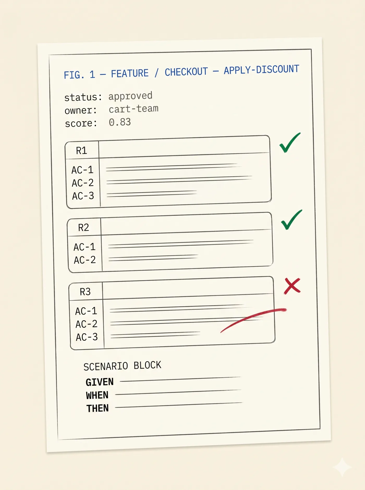

# SpecScore

**An open standard for AI-readable software specifications.**

Structured Markdown + YAML for features, requirements, acceptance criteria, plans, and tasks — designed so AI agents can read a spec and execute against it without losing information to ambiguity. Specs are plain files in `spec/`. Lint runs in CI and in pre-commit hooks. Status transitions are CLI-driven.

- 🌐 **Website:** https://specscore.md
- 🎼 **Studio:** https://specscore.studio
- 📦 **Main repo:** [**specscore**](https://github.com/specscore/specscore) — the format, specified using itself



---

## SpecScore.md — the open format

The open Markdown + YAML format for software specifications. Portable by construction: adopt with any AI-coding tool, or none. Your specs come with you.

- 📐 [**specscore**](https://github.com/specscore/specscore) — the format itself, specified using SpecScore
- 🌐 [specscore.md](https://specscore.md) — read the specification online
- 📖 [Ecosystem overview](https://specscore.md/ecosystem)

```bash
curl -fsSL https://specscore.md/install/get-cli | sh

specscore spec lint              # validate the current spec tree
specscore feature list           # list features
specscore feature show <slug>    # inspect a feature
```

---

## SpecStudio Skill — the Claude Code plugin

The fastest way to write strongly-formatted, lintable SpecScore specifications with an AI agent. An opinionated spec-driven-development workflow: `/ideate` → `/specify` → `/plan` → `/implement`.

- 🎛 [**specstudio-skills**](https://github.com/specscore/specstudio-skills) — Claude Code plugin (MIT, free forever)
- 🛠 [**ai-plugin-specscore**](https://github.com/specscore/ai-plugin-specscore) — thin CLI-wrapping plugin for community workflows

```text
/plugin marketplace add specscore/ai-marketplace
/plugin install specstudio@specscore
```

---

## SpecScore.Studio — the hosted authoring surface

The first-party web UI for SpecScore: browse spec graphs from any GitHub repo, view documents and dependencies, and (soon) author specs collaboratively.

- 🎼 [**specscore.studio**](https://specscore.studio) — the live app
- 🖼 [**specscore-studio**](https://github.com/specscore/specscore-studio) — landing page (Astro)
- ⚙️ [**specscore-studio-app**](https://github.com/specscore/specscore-studio-app) — the web app itself

---

## Used by

Projects and tools built on SpecScore:

- [**specscore-cli**](https://github.com/specscore/specscore-cli) — reference CLI: lint, query, and scaffold SpecScore specifications
- [**rehearse**](https://github.com/specscore/rehearse) — Markdown-native test framework that turns SpecScore specs into executable scenarios
- [**spec-driven-todo-app**](https://github.com/specscore/spec-driven-todo-app) — demo todo app specified end-to-end with SpecScore
- [**inGitDB**](https://github.com/ingitdb) — open-source Git-backed versioned database, specified with SpecScore

Using SpecScore in your project? Open a PR.

---

## Quick links

| | |
|---|---|
| 📐 Format | [specscore.md](https://specscore.md) · [feature spec](https://specscore.md/feature-specification) · [plan spec](https://specscore.md/plan-specification) |
| 🛠 Tools | [CLI](https://github.com/specscore/specscore-cli) · [SpecStudio Skill](https://github.com/specscore/specstudio-skills) · [Rehearse](https://github.com/specscore/rehearse) |
| 🎼 Hosted | [specscore.studio](https://specscore.studio) |
| 📦 Install | `curl -fsSL https://specscore.md/install/get-cli \| sh` |
